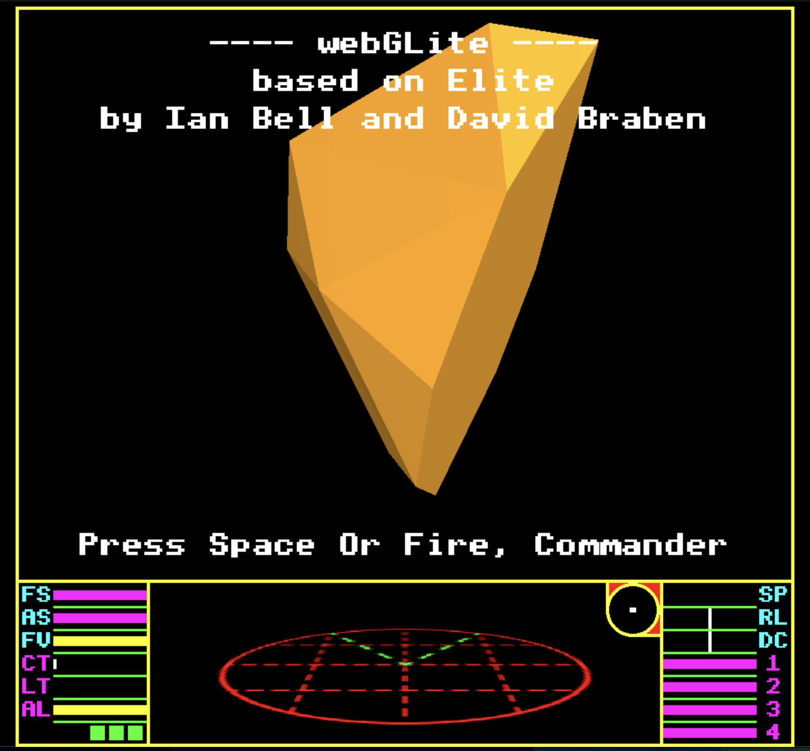

# webGLite

### A WebGL/TypeScript port of the classic BBC Micro game Elite

**[▶ Play it now at webglite.com](https://webglite.com)**



---

Trade, fight, and explore the original 1984 universe — running entirely in your browser. This is a faithful recreation of David Braben and Ian Bell's groundbreaking space game, built from the ground up in TypeScript and WebGL.

## Features

- Full 3D flight and combat
- Trading between systems
- Procedurally generated galaxy (the original 8 galaxies)
- Original ship models converted from Ian Bell's VRML archive
- Authentic BBC Micro font and UI styling
- Original audio and Blue Danube docking music

## Running locally

```bash
npm install
npm start
```

## Credits

This project wouldn't exist without:

- **David Braben and Ian Bell** — the original authors. I was blown away by this game on launch in 1984 and played it for staggering numbers of hours. The more I learn about how it works, the more astounded I am that they got all this running on an 8-bit micro.

- **[Mark Moxon's Elite documentation](https://www.bbcelite.com/)** — an incredible work of art in its own right. His annotated source code made this project possible.

- **[Ian Bell's Elite archive](http://www.elitehomepage.org/archive/index.htm)** — the ship models in VRML format that I converted for use here.

- **[Solar System Scope](https://www.solarsystemscope.com/textures/)** — planet textures (CC Attribution license).

## Technical notes

I've tried to use similar terminology to Mark Moxon's documentation, so this codebase can serve as a readable expression of Elite's internals in a modern language.

<details>
<summary><strong>Coordinate system</strong></summary>

Elite uses 23-bit numbers + 1 sign bit for ship coordinates (+/- 23 bits), represented as:

```
x = (x_sign x_hi x_lo)
y = (y_sign y_hi y_lo)
z = (z_sign z_hi z_lo)
```

The player is always at (0,0,0) and the world revolves around them. Ships appear on the scanner when their high byte is < 63 (0x3300 units in any axis).

</details>

<details>
<summary><strong>Timing and game feel</strong></summary>

The original game expressed acceleration and movement in terms of main loop cycles, not real time — which worked on fixed hardware but not on modern systems.

I approximated the original feel by recording myself playing Elite in BeebEm, measuring how long acceleration, pitch, roll, and scanner distances actually took, then calibrating to match. The original ran at 10-20fps depending on scene complexity; spawning happened roughly every 256 loop iterations (~17 seconds).

</details>

<details>
<summary><strong>Scanner rendering</strong></summary>

Currently rendered in 3D using a texture, which creates the slightly "dirty" oblique look. Alternatives I've considered: rendering as a 3D model with triangles, or falling back to 2D.

</details>

<details>
<summary><strong>Ship models</strong></summary>

Converted from Ian Bell's VRML archive to Wavefront OBJ format, then loaded into WebGL vertex and index buffers.

</details>

## To do

- Move shaders to external files
- Rationalise WebGL code (now that the approach is settled)

## License

The original game, code, ship models, and names are copyright their original owners.

The TypeScript code in this repository is licensed under **Creative Commons Attribution-NonCommercial-ShareAlike** — you can copy, use, and modify it, but you can't sell it, and derivative works must use the same license.

---

*If you enjoy this, consider [starring the repo](https://github.com/JamesRandall/webGLite) — it helps others find it.*